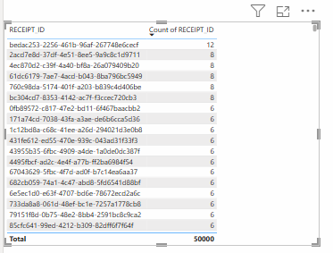
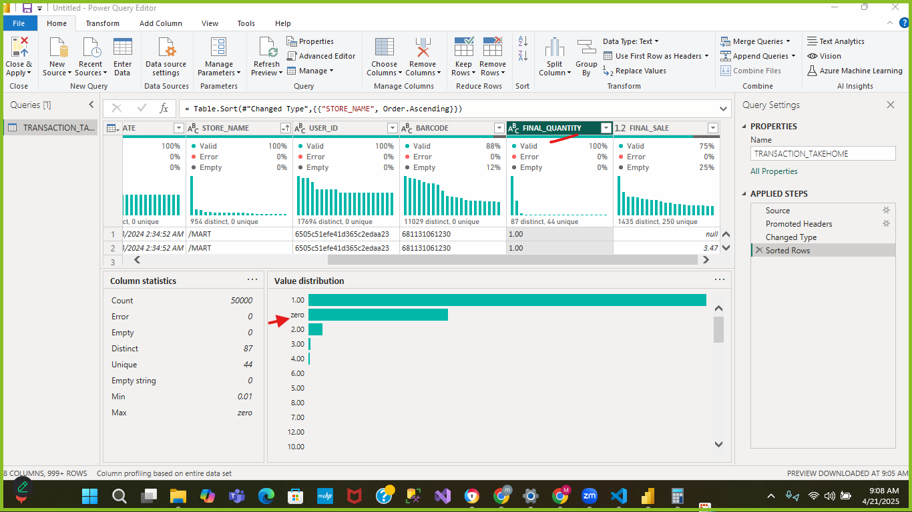
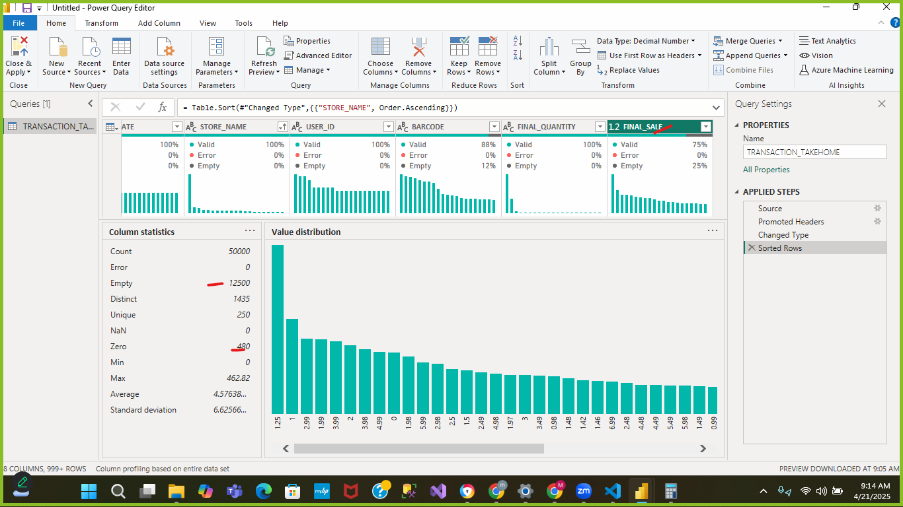
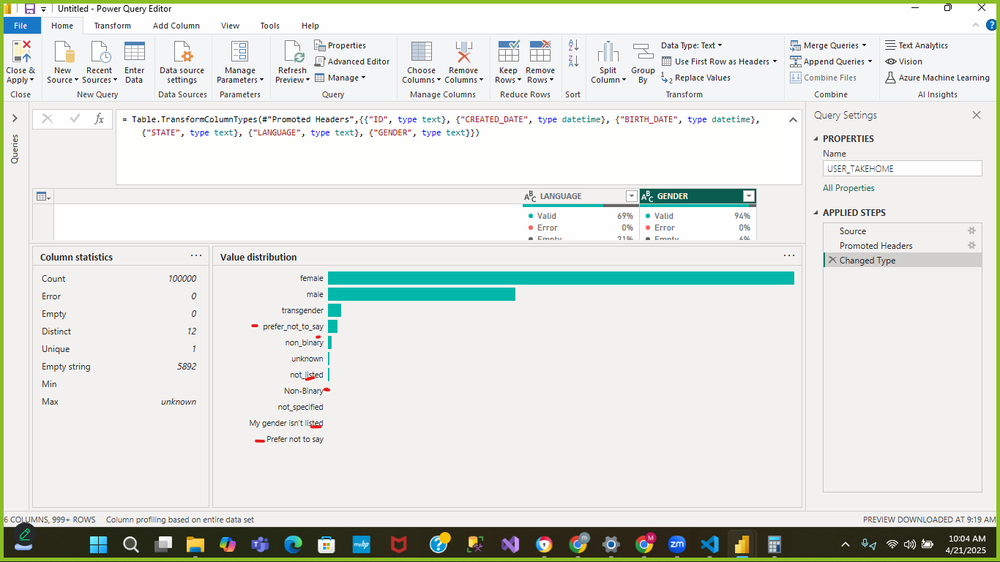
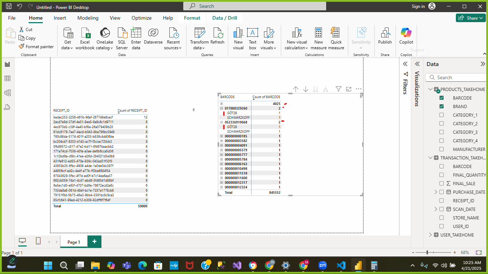

TRANSACTION_TAKEHOME.csv
* Receipt_ID
    - There are duplicate records in this column but this should not be the case as the receipt_id is exepected in this case to be the primary key of the transaction table, identifying each receipt generated as a unique transaction
    - WE have 24,440 unique records from a total record of 50,000 representing 48.89% of the data
    - Receipt_ID "bedac253-2256-461b-96af-267748e6cecf" occurred as much as 12 times, while we have some occuring 8, 6 times etc. See sample distribution below
    
* Store Name
    - There is a store named "/MART", this is possibly a naming error, 
    - there are two occurence of this and likely duplicates (although the final slaes columns differentiates the two records)
* Barcode Column
    - missing for 5,762 records out of 50,000 records
    - There are duplicate records in the column as well as we have only 11,029 unique barcodes, however this is expected as this is a transaction table and the same product is expected to be sold multiple times
* Final_Quantity
    - This column cannot assume a numeric data type because one of its content is text and labelled "zero". This needs to be cleaned
    
* Final_Sales
    - There are 12,500 null/empty cells (25% of the dataset) and this begs the question of at what price were these sales made.
    - 480 of the records have a final sales figure as 0. Does this imply they were given out for free or a discount had happened?
    

USER_TAKEHOME.csv
* ID
    - There are 100,000 unique records int he ID column which is perfect, and identifies this column as the primary key of the User table

* Birth Date
    - There are 3,675 user records without date of birth
    - There are 2 customers with date of birth recorded as Dec 31, 1899 as well as some 1900, this should be revalidated
* State
    - State format is consistent across board (2 digits)
    - 4,812 records are without state information
* Language
    - There are 30,508 records without thier languague captured...that is roughly 30.5% of the users
    - En is understood to be English and Es-419 assumed to be Spanish
* Gender
    - There are 12 distinct gender selections however some of them are duplicated from inconsistencies, a list of options to pick from will resolve this e.g "prefer_not_to_say" and "Prefer not to say".
    

PRODUCTS_TAKEHOME.csv
* BarCode
    - This should be the primary key of the dataset however it fails some the null test, as a primary key cannot have nulls or blanks in it (This has 4,025 null records), however in terms of cardinality, it has the highest cardinality/uniqueness in the product table. (841,523 out of 845,552 records) and also 2 records that are duplicated by the Brand name column
    
